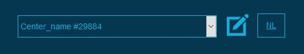

<h1>formation.be / opleidingen.be : SOAP API</h1>

location: http://formation.be/api/
 
 
 
<b>Functions:</b>

insert_training ( login, password, json_attributes )

update_training ( login, password, json_attributes )

delete_training ( login, password, json_attributes )

get_domains ( language ) 
<i>language: 'fr' or 'nl'</i>
 
 
 
<b>Return:</b> 
Mixed / JSON array
 
 
 
<b>How to find my center id?</b> 

